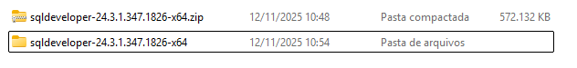
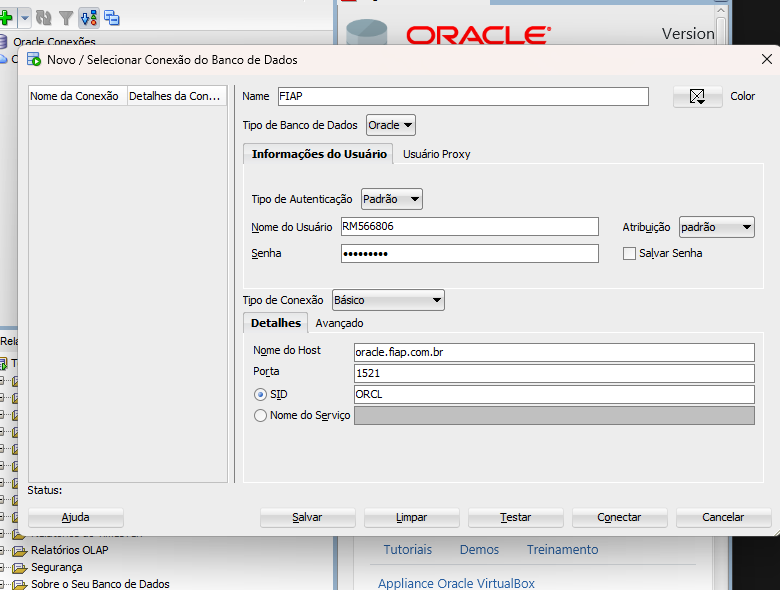
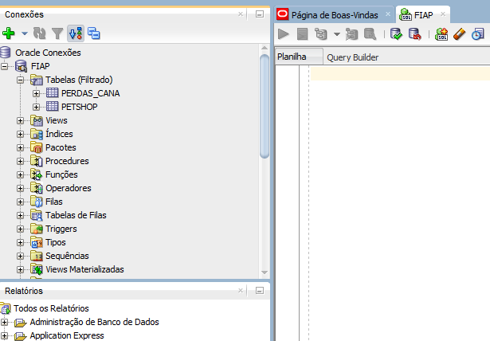
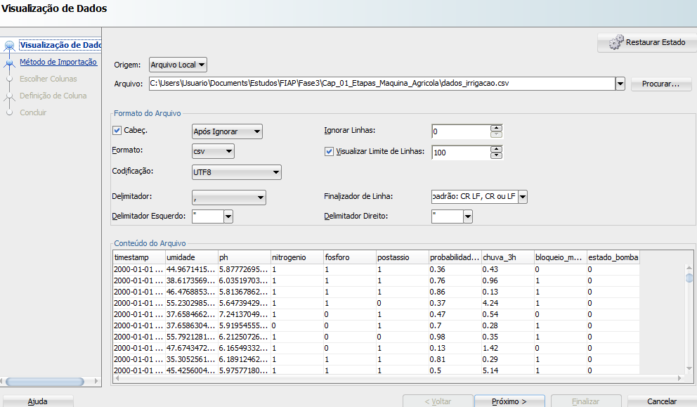
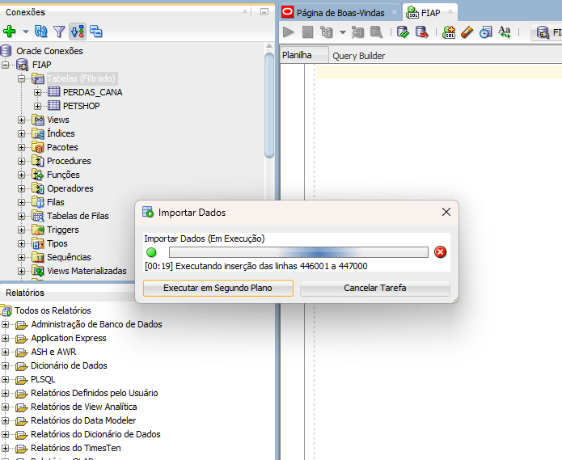
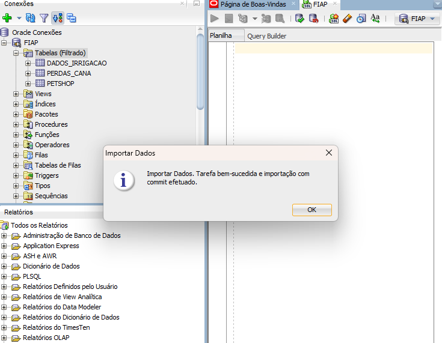
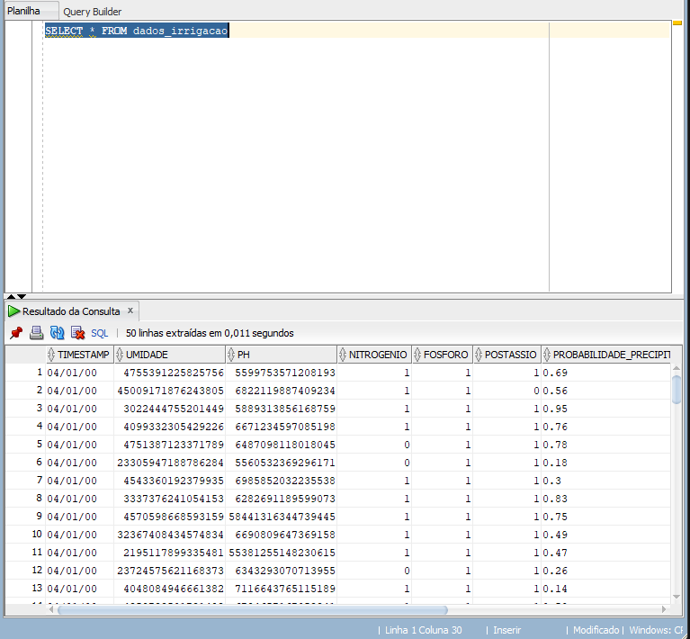

# FIAP - Faculdade de Informática e Administração Paulista

 

# Nome do projeto
 -> Projetos Etapas de uma Máquina Agrícola e opcionais sendo: Dashboard em Python e Machine Learning no Agronegócio

## Nome do grupo

## 👨‍🎓 Integrantes: 
- <a href="https://www.linkedin.com/in/luan-g-432896b5/">Luan Gonçalves Gomes 1</a>

## 👩‍🏫 Professores:
### Tutor(a) 
- <a href="https://www.linkedin.com/in/sabrina-otoni-22525519b/">Sabrina Otoni</a>
### Coordenador(a)
- <a href="https://www.linkedin.com/company/inova-fusca">Nome do Coordenador</a>

## 📜 Descrição

**

## ⚙️ Funcionalidade do Sistema ORACLE
1. Descompactação do arquivo

2. Nova conexão

3. Icone de tabelas(Filtrado) 
Existe uma tabela que já contempla anteriormente o projeto anterior como pode ser visto com o nome de PERDAS_CANA

4. Importação dos dados

5. Select no banco de dados

## IR ALÉM - DASHBOARD EM PYTHON 
Como extensão opcional do projeto, foi desenvolvida uma dashboard interativa em Python utilizando matplotlib/seaborn para visualização gráfica. O objetivo dessa dashboard é oferecer uma visão rápida e intuitiva sobre as condições do solo e da irrigação, apoiando decisões operacionais no campo.

O dashboard trabalha sobre a mesma base de dados sintética utilizada no módulo de Machine Learning, contendo informações de umidade, N, P, K, pH, temperatura, chuva e estado da irrigação. A partir desses dados, são gerados gráficos e indicadores que permitem:
- visualizar a distribuição da umidade do solo e sua variação ao longo do tempo;
- inspecionar a distribuição de nutrientes (P e K), ajudando a identificar possíveis desbalanceamentos;
- analisar a relação entre pH do solo e o estado da irrigação por meio de boxplots;

##  IR ALÉM - Machine Learning no Agronegócio
Nesta etapa foi desenvolvida uma solução completa de Machine Learning aplicada ao agronegócio, utilizando como base o arquivo produtos_agricolas.csv, composto pelas variáveis: N, P, K, temperatura, umidade, pH, chuva, além do rótulo binário label, indicando se aquela combinação de condições pode ser considerada produtiva (1) ou não (0).
O objetivo foi construir um pipeline analítico capaz de:
- realizar uma análise exploratória detalhada;
- treinar modelos preditivos;
- identificar padrões de produtividade para culturas agrícolas;

## 📁 Estrutura de pastas
Fase3/
└── Cap_01_Etapas_Maquina_Agricola/
    ├── README.md
    ├── raw/
    │   ├── dados_genericos_reg.csv
    │   └── dados_irrigacao.csv
    ├── imagens/
    │   ├── image-1.png
    │   ├── image-2.png
    │   ├── image-3.png
    │   ├── image-4.png
    │   ├── image-5.png
    │   ├── image-6.png
    │   └── image.png
    └── opcionais/
        ├── data/
        │   └── ano=2024/
        ├── eda_produtividade/
        ├── comparativo_modelos_reg.csv
        ├── perfis_ideais_reg.csv
        ├── luan_gomes_rm566806_dashboard_irrigacao.ipynb
        └── luan_gomes_rm566806_machine_learning.ipynb

## 🔧 Como executar o código
Fazer a instalação das bibliotecas na primeira linha do jupyter notebook e rodar o modelo ajustando N para trabalhar em cima das amostras. 

## 🗃 Histórico de lançamentos

* 0.1.0 - 12/11/2025

## 📋 Licença

<a property="dct:title" rel="cc:attributionURL" href="https://github.com/agodoi/template">MODELO GIT FIAP</a> por <a rel="cc:attributionURL dct:creator" property="cc:attributionName" href="https://fiap.com.br">Fiap</a> está licenciado sobre <a href="http://creativecommons.org/licenses/by/4.0/?ref=chooser-v1" target="_blank" rel="license noopener noreferrer" style="display:inline-block;">Attribution 4.0 International</a>.

