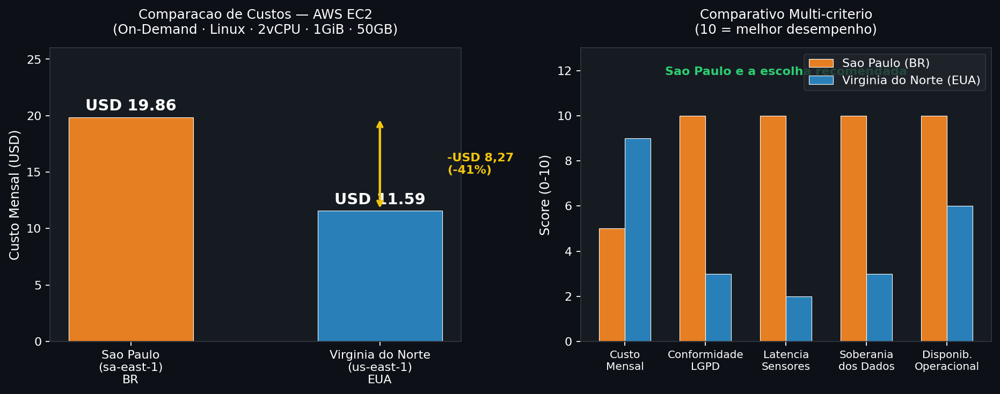

# FarmTech Solutions — Previsão de Rendimento de Safra
### FIAP · Fase 5 · Cap. 1 · FarmTech Era Cloud Computing

---

## Links Rapidos

| Recurso | Link |
|---|---|
| **Notebook Jupyter (Entrega 1)** | [notebook.ipynb](./notebook.ipynb) |
| **Video Demonstrativo (Entrega 1)** | [Assistir no YouTube](https://youtu.be/V0xefvv9eL0) |
| **Video Demonstrativo (Entrega 2)** | [Assistir no YouTube](https://youtu.be/V0xefvv9eL0) |

---

## Sobre o Projeto

A **FarmTech Solutions** foi contratada para desenvolver uma solução de inteligência artificial para uma fazenda de médio porte (200 hectares) que produz múltiplas culturas. O objetivo é analisar condições ambientais e de solo para **prever o rendimento de safra** e **identificar tendências de produtividade**.

Este repositório contém as entregas da Fase 5:

- **Entrega 1:** Análise Exploratória de Dados (EDA), Clusterização e 5 modelos preditivos de regressão supervisionada
- **Entrega 2:** Estimativa de custos e justificativa tecnica para hospedagem em nuvem AWS

---

## Dataset

**Arquivo:** `raw/crop_yield.csv` · **156 registros** · **4 culturas agrícolas**

| Variável | Descrição |
|----------|-----------|
| `Crop` | Tipo de cultura (Cocoa beans, Oil palm fruit, Rice paddy, Rubber natural) |
| `Precipitation (mm day-1)` | Precipitação diária em mm |
| `Specific Humidity at 2 Meters (g/kg)` | Umidade específica do ar a 2m do solo |
| `Relative Humidity at 2 Meters (%)` | Umidade relativa a 2m do solo |
| `Temperature at 2 Meters (C)` | Temperatura em ºC a 2m do solo |
| `Yield` | **Alvo** — Rendimento da safra em toneladas por hectare |

---

## Estrutura do Repositório

```
cap_1_farmetch_era_cloud_computing/
├── raw/
│   └── crop_yield.csv          # Dataset original
├── notebook.ipynb              # Notebook principal (toda a solução)
├── README.md                   # Este arquivo
└── *.png                       # Visualizações geradas pelo notebook
```

---

## Como Executar

### Pré-requisitos

```bash
pip install pandas numpy matplotlib seaborn scikit-learn jupyter
```

### Executando o Notebook

```bash
jupyter notebook notebook.ipynb
```

> **Importante:** Execute todas as células em ordem. O notebook está completamente documentado com células de markdown explicando cada etapa.

---

## Conteúdo do Notebook

O notebook está organizado em 6 seções:

1. **Configuração do Ambiente** — importações e configurações visuais
2. **Análise Exploratória (EDA)** — estrutura dos dados, distribuições, correlações e relações entre variáveis
3. **Clusterização** — K-Means com Método do Cotovelo, visualização PCA e detecção de outliers via IQR
4. **5 Modelos de Regressão:**
   - Regressão Linear (baseline)
   - Ridge (regularização L2)
   - Árvore de Decisão
   - Random Forest
   - Gradient Boosting
5. **Comparação de Modelos** — tabela de métricas, gráficos predito vs. real, análise de resíduos
6. **Conclusões** — achados, pontos fortes e limitações

---

## Algoritmos Utilizados

| # | Algoritmo | Tipo | Justificativa |
|---|-----------|------|---------------|
| 1 | Regressão Linear | Paramétrico | Baseline interpretável |
| 2 | Ridge | Paramétrico + Regularização | Controle de multicolinearidade |
| 3 | Árvore de Decisão | Não-paramétrico | Captura não-linearidades, alta interpretabilidade |
| 4 | Random Forest | Ensemble (Bagging) | Robusto, reduz variância via múltiplas árvores |
| 5 | Gradient Boosting | Ensemble (Boosting) | Alta performance preditiva, corrige erros sequencialmente |

---

## Métricas de Avaliação

- **R²** (Coeficiente de Determinação) — proporção da variância explicada
- **MAE** (Mean Absolute Error) — erro médio absoluto em ton/ha
- **RMSE** (Root Mean Squared Error) — penaliza erros grandes
- **Cross-Validation R²** (5-fold) — estimativa de generalização

---

## Entrega 2 — Computação em Nuvem (AWS)

> **Video demonstrativo:** [Assistir no YouTube](https://youtu.be/V0xefvv9eL0) — explica a comparacao de custos usando a calculadora AWS e justifica a solucao escolhida.

### Contexto

O modelo de Machine Learning desenvolvido na Entrega 1 precisa ser hospedado em infraestrutura de nuvem para receber dados em tempo real dos sensores da fazenda (precipitação, umidade, temperatura) e retornar predições de rendimento via API.

---

### Estimativa de Custos — AWS Calculator (On-Demand, 100%)

A configuração avaliada para hospedar a API foi:

| Configuração | Especificação |
|---|---|
| Sistema Operacional | Linux |
| vCPUs | 2 |
| Memória RAM | 1 GiB |
| Rede | Até 5 Gigabit |
| Armazenamento | 50 GB (HD / EBS) |
| Modelo de Preço | On-Demand (100%) |

> A instância que melhor atende essas especificações na AWS é a família **t3** ou **t4g**, adequada para workloads leves de API com ML de baixa latência.

---

### Resultado da Comparação de Regiões

| | Região | Custo Mensal Estimado |
|---|---|---|
| 🇧🇷 | **América do Sul — São Paulo** (`sa-east-1`) | **USD 19,86 / mês** |
| 🇺🇸 | **Leste dos EUA — Virgínia do Norte** (`us-east-1`) | **USD 11,59 / mês** |

```
Diferença absoluta : USD  8,27 / mês
Diferença relativa : ~41% mais barato na Virgínia
Diferença anual    : USD 99,24 / ano
```

#### Visualização Comparativa



> Grafico gerado com os valores oficiais da AWS Pricing Calculator. Esquerda: custo mensal por regiao. Direita: comparativo multi-criterio (10 = melhor).

---

### Análise e Decisão

#### Por que a Virgínia é mais barata?

A região `us-east-1` (Norte da Virgínia) é a **região mais antiga e com maior escala da AWS**, o que resulta em:

- Maior densidade de datacenters e infraestrutura consolidada
- Concorrência de mercado mais intensa nos EUA
- Custos operacionais menores por economia de escala
- Todos os serviços AWS são lançados primeiro nessa região (maior disponibilidade de instâncias)

A região `sa-east-1` (São Paulo) possui custos de infraestrutura local mais elevados, impostos sobre operações de TI no Brasil e menor escala operacional.

---

### Qual opção escolher? Justificativa

#### Cenário avaliado

O enunciado acrescenta duas restrições importantes:

1. **Acesso rápido aos dados dos sensores** — os sensores estão fisicamente na fazenda, localizada no Brasil.
2. **Restrições legais para armazenamento no exterior** — dados de sensores agrícolas vinculados a operações no Brasil podem estar sujeitos à **LGPD (Lei Geral de Proteção de Dados, Lei nº 13.709/2018)**, que restringe a transferência internacional de dados pessoais e operacionais sem salvaguardas adequadas.

---

#### Decisão: Região de São Paulo — `sa-east-1`

Apesar do custo **41% maior** (USD 8,27/mês a mais), a região de São Paulo é a escolha correta. Os motivos são:

| Critério | São Paulo (BR) ✅ | Virgínia do Norte (EUA) ❌ |
|---|---|---|
| **Conformidade legal (LGPD)** | Dados permanecem no Brasil | Transferência internacional exige contrato específico |
| **Latência dos sensores** | Baixa (~5–20 ms da fazenda ao servidor) | Alta (~150–200 ms intercontinental) |
| **Disponibilidade dos dados** | Independe de link internacional | Falha de backbone afeta operação |
| **Custo mensal** | USD 19,86 | USD 11,59 |
| **Soberania dos dados** | Garantida | Sujeita à legislação norte-americana |

#### Sobre a Latência

Para uma API que recebe dados de sensores em campo e responde com predições em tempo real, a latência é crítica. Uma diferença de 150–200 ms por requisição pode comprometer o monitoramento contínuo das culturas. A proximidade geográfica da região São Paulo garante respostas ágeis e maior resiliência operacional.

#### Sobre a LGPD

O Art. 33 da LGPD estabelece que a transferência internacional de dados pessoais só é permitida para países com nível de proteção adequado ou mediante cláusulas contratuais específicas. Embora dados de sensores agrícolas possam não ser estritamente "dados pessoais", operações vinculadas a pessoas jurídicas brasileiras e dados de produção nacional têm melhor respaldo jurídico mantidos em território nacional.

#### Consideração sobre Custo

A diferença de USD 8,27/mês (USD 99,24/ano) é negligenciável frente aos riscos legais, de latência e de disponibilidade. Em uma fazenda de 200 hectares com produção de múltiplas culturas, esse valor representa uma fração mínima do custo operacional total.

---

### Arquitetura Proposta na Nuvem

```
[Sensores da Fazenda (BR)]
         │
         │ HTTPS (baixa latência)
         ▼
┌─────────────────────────────┐
│  AWS EC2 — sa-east-1 (SP)   │
│  Linux · 2 vCPU · 1 GiB RAM │
│  50 GB EBS · até 5 Gigabit  │
│                             │
│  ┌─────────────────────┐    │
│  │   API (FastAPI)     │    │
│  │   Recebe dados      │    │
│  │   Roda ML Model     │    │
│  │   Retorna predição  │    │
│  └─────────────────────┘    │
└─────────────────────────────┘
         │
         │ Resposta com Rendimento Previsto
         ▼
[Dashboard / Painel da Fazenda]
```

---

## Grupo

> Projeto desenvolvido para a disciplina de Machine Learning — FIAP · Fase 5
> Luan Gonçalves Gomes - RM566806
