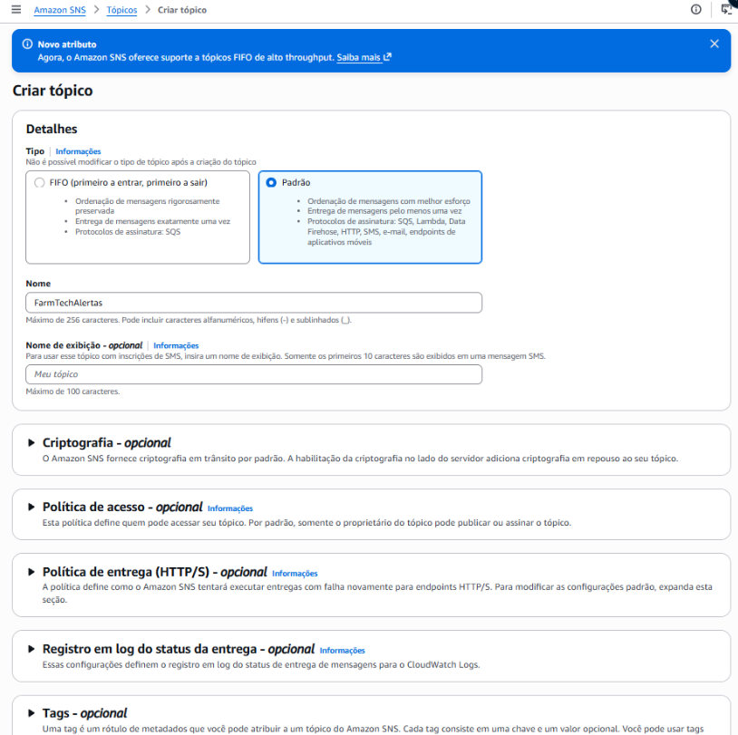
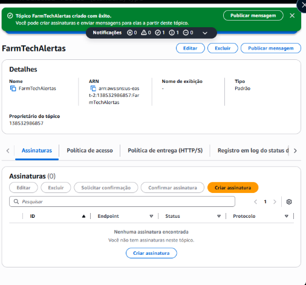
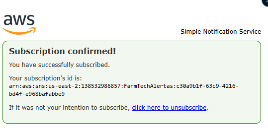
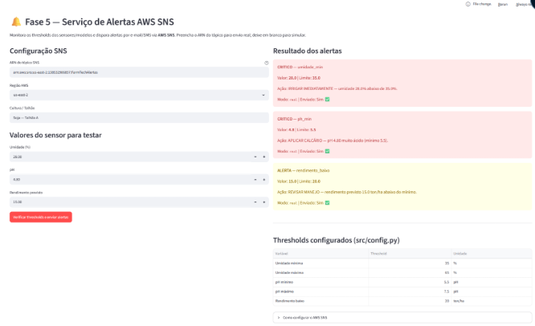
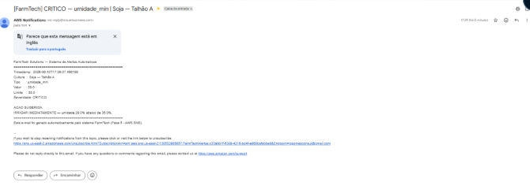
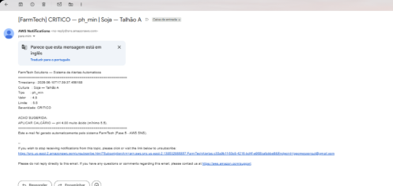
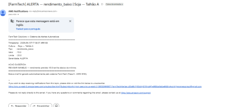

# FarmTech Solutions — A Consolidação de um Sistema

### FIAP · Fase 7 · IA Como Fertilizante Digital · Cap. 1

---

## Links Rápidos

| Recurso | Link |
|---|---|
| **Vídeo Atividade 1** | *(https://youtu.be/4zeQbTov5eQ)* |
| **Vídeo Ir Além 1 e 2 Juntos** | *(https://youtu.be/NBThqXHFaRI)* |
| **Repositório GitHub** | *(https://github.com/TheFirstGomes/Estudos/tree/main/FIAP/Fase7)* |

---

## Sobre o Projeto

A **Fase 7** consolida em um único sistema Python todos os serviços desenvolvidos nas Fases 1 a 6 do projeto FarmTech Solutions. O objetivo é demonstrar como cada camada tecnológica — desde cálculos de campo até alertas em nuvem — se integra em um pipeline coeso de agricultura de precisão.

A solução é executável por um único comando (`streamlit run dashboard/app.py`) e expõe cada fase como uma aba interativa do dashboard.

---

## Integrante

- **Luan Gonçalves Gomes** — RM 566806

---

## Estrutura do Repositório

```
Cap_01_A_Consolidacao_De_Um_Sistema/
├── run.py                         # Menu interativo no terminal
├── requirements.txt
├── dashboard/
│   └── app.py                     # Dashboard Streamlit unificado (6 abas)
├── src/
│   ├── config.py                  # Caminhos e thresholds centralizados
│   ├── fase1/area_insumos.py      # Cálculo de área, insumos e API clima
│   ├── fase2/database.py          # CRUD SQLite — culturas, sensores, irrigação
│   ├── fase3/iot_simulacao.py     # Simulação ESP32 (lógica idêntica ao .ino)
│   ├── fase4/ml_inferencia.py     # Random Forest — umidade, pH, rendimento
│   ├── fase5/aws_alertas.py       # AWS SNS — alertas por e-mail/SMS
│   └── fase6/visao.py             # Classificação de imagens (OpenCV / simulado)
├── data/
│   └── farmtech_fase7.db          # Banco SQLite (gerado na primeira execução)
└── docs/
    ├── aws/                       # Prints da configuração AWS
    └── dashboard/                 # Prints do dashboard em operação
```

---

## Como Executar

### Pré-requisitos

```bash
# Python 3.12 instalado
python --version

# Criar e ativar ambiente virtual
python -m venv .venv
.venv\Scripts\Activate.ps1   # Windows
source .venv/bin/activate     # Linux/Mac

# Instalar dependências
pip install -r requirements.txt
```

### Opção 1 — Dashboard completo (recomendado)

```bash
streamlit run dashboard/app.py
```

Acesse `http://localhost:8501` no navegador.

### Opção 2 — Menu interativo no terminal

```bash
python run.py
```

### Opção 3 — Módulos individuais

```bash
python src/fase2/database.py       # Inicializa banco
python src/fase3/iot_simulacao.py  # Simula 5 leituras ESP32
python src/fase4/ml_inferencia.py  # Testa previsões ML
python src/fase5/aws_alertas.py    # Testa alertas (modo simulado)
```

---

## Fases Integradas

### Fase 1 — Base de Dados Inicial (`src/fase1/area_insumos.py`)

Implementa os cálculos de área de plantio (retangular, circular e triangular), quantidades de insumos por hectare e estimativa de custo. Integra a API meteorológica **OpenWeatherMap** — o mesmo endpoint usado no sketch ESP32 da Fase 2 — para obter probabilidade de chuva e bloqueio de irrigação.

| Função | Descrição |
|--------|-----------|
| `calcular_area_retangular/circular/triangular` | Retorna área em m² |
| `calcular_insumos(area_m2)` | Fertilizante, calcário, herbicida, água |
| `calcular_custo_estimado(insumos)` | Estimativa em R$ |
| `consultar_clima(lat, lon, api_key)` | Forecast 3h da OpenWeatherMap |
| `clima_simulado()` | Fallback sem chave de API |

---

### Fase 2 — Banco de Dados Estruturado (`src/fase2/database.py`)

Esquema relacional SQLite adaptado do modelo Oracle entregue na Fase 2. Implementa CRUD completo para as quatro entidades do sistema FarmTech.

**Diagrama de entidades:**

```
tbl_culturas ──┬── tbl_sensores
               ├── tbl_irrigacao
               └── tbl_colheitas
```

| Tabela | Campos principais |
|--------|-------------------|
| `tbl_culturas` | id, nome, variedade, area_ha, data_plantio, limites de pH e umidade |
| `tbl_sensores` | id, id_cultura, timestamp, umidade_solo, ph, N/P/K, temperatura, dados meteo |
| `tbl_irrigacao` | id, id_cultura, timestamp, duracao_min, volume_litros, motivo_ativacao |
| `tbl_colheitas` | id, id_cultura, data_colheita, producao_ton, perda_ton, eficiencia_pct |

---

### Fase 3 — IoT e Automação Inteligente (`src/fase3/iot_simulacao.py`)

Simula o comportamento do ESP32 com lógica de decisão **idêntica ao `sketch.ino`** da Fase 2:

- **Ligar bomba:** `!wx_block AND umidade < 35% AND pH ∈ [6.0, 6.8] AND NPK ok`
- **Desligar bomba:** `wx_block OR umidade > 45% OR pH fora do range OR NPK insuficiente`

Cada leitura é persistida em `tbl_sensores` e eventos de irrigação em `tbl_irrigacao`.

```
Sensor DHT22 → Umidade
Sensor LDR   → pH (via ADC 12-bit, fórmula: pH = adc/4095 × 14)
Botões N/P/K → Presença de nutrientes
API OpenWeatherMap → Bloqueio por chuva (pop ≥ 60% ou chuva ≥ 2 mm/3h)
```

---

### Fase 4 — Dashboard com Data Science (`src/fase4/ml_inferencia.py`)

Carrega os modelos **Random Forest** treinados na Fase 4 (arquivos `.joblib`) e disponibiliza inferência em tempo real. O modelo de rendimento apresenta R² = 0.749, com erro médio de 4 ton/ha.

| Modelo | Target | R² | MAE |
|--------|--------|-----|-----|
| `modelo_regressao_umidade` | Umidade futura (%) | 0.078 | 7.60 |
| `modelo_regressao_ph` | pH futuro | 0.001 | 0.56 |
| `modelo_regressao_rendimento_esperado` | Rendimento (ton/ha) | **0.749** | 4.00 |

**Ações geradas automaticamente:**

| Condição | Ação sugerida |
|----------|---------------|
| Umidade prevista < 40% | IRRIGAR IMEDIATAMENTE |
| Umidade prevista > 65% | SUSPENDER IRRIGAÇÃO |
| pH previsto < 5.5 | APLICAR CALCÁRIO |
| pH previsto > 7.5 | APLICAR ENXOFRE |
| Rendimento previsto < 20 ton/ha | REVISAR MANEJO |

---

### Fase 5 — Cloud Computing & Alertas AWS SNS (`src/fase5/aws_alertas.py`)

Serviço de mensageria na **AWS SNS** que monitora os thresholds dos sensores e dispara alertas por e-mail para os funcionários da fazenda.

#### Configuração do Tópico SNS

**Passo 1 — Criar tópico:**
Acesse AWS Console → SNS → Tópicos → Criar tópico → Tipo: **Padrão** → Nome: `FarmTechAlertas`



**Passo 2 — Tópico criado com ARN:**



```
ARN: arn:aws:sns:us-east-2:138532986857:FarmTechAlertas
```

**Passo 3 — Criar assinatura de e-mail:**
Assinaturas → Criar assinatura → Protocolo: `Email` → Endpoint: `<seu-email>`

**Passo 4 — Assinatura confirmada:**



#### Alertas disparados em produção

Com os sensores da cultura **Soja — Talhão A** em condição crítica (umidade 28%, pH 4.8, rendimento previsto 15 ton/ha), o sistema disparou automaticamente **3 alertas simultâneos**:



**E-mails recebidos (AWS Notifications):**


| Alerta | Severidade | Ação |
|--------|-----------|------|
| `umidade_min` | CRITICO | IRRIGAR IMEDIATAMENTE — umidade 28% abaixo de 35% |
| `ph_min` | CRITICO | APLICAR CALCÁRIO — pH 4.80 muito ácido |
| `rendimento_baixo` | ALERTA | REVISAR MANEJO — 15 ton/ha abaixo do mínimo |

**E-mail completo — CRITICO umidade_min:**



**E-mail completo — CRITICO ph_min:**



**E-mail completo — ALERTA rendimento_baixo:**



#### Thresholds configurados (`src/config.py`)

| Variável | Threshold | Unidade |
|----------|-----------|---------|
| Umidade mínima | 35 | % |
| Umidade máxima | 65 | % |
| pH mínimo | 5.5 | pH |
| pH máximo | 7.5 | pH |
| Rendimento baixo | 20 | ton/ha |

#### Arquitetura AWS

```
[Dashboard Streamlit]
        │
        ▼  boto3.client('sns').publish()
[AWS SNS — Tópico FarmTechAlertas]
        │
        ├──▶ [Subscription: Email] ──▶ lggomesconsul@gmail.com
        └──▶ (extensível: SMS, Lambda, SQS)
```

---

### Fase 6 — Visão Computacional (`src/fase6/visao.py`)

Sistema de classificação de saúde da plantação com dois modos de operação:

**Modo OpenCV** — analisa o espectro HSV da imagem:
- Verde intenso (H: 35–85) → `Saudável`
- Amarelo/marrom (H: 15–34) → `Doença foliar`
- Verde < 10% do frame → `Deficiência nutricional`

**Modo Simulado** — interface para demonstração sem imagem real, espelhando o output do YOLO/MobileNetV2 treinados nos notebooks da Fase 6.

| Classe | Ação corretiva |
|--------|---------------|
| Saudável | Nenhuma ação. Monitoramento contínuo. |
| Praga detectada | Aplicar defensivo. Isolar talhão afetado. |
| Doença foliar | Aplicar fungicida. Retirar folhas afetadas. |
| Deficiência nutricional | Revisar adubação. Coletar amostra de solo. |
| Crescimento irregular | Verificar irrigação e espaçamento. |

Os modelos YOLO customizado e MobileNetV2 com Fine Tuning desenvolvidos na Fase 6 podem ser integrados substituindo o método `_inferir_opencv()` em `src/fase6/visao.py`.

---

## Dashboard Integrado

O dashboard unificado organiza todas as fases em abas Streamlit:

| Aba | Fase | Funcionalidade |
|-----|------|----------------|
| 🏠 Visão Geral | — | Métricas do sistema e últimas leituras |
| 📐 Área & Banco | 1 e 2 | Cálculo de área, insumos, API clima, CRUD completo |
| 🤖 IoT & Irrigação | 3 | Simulação ESP32, lógica da bomba, gráficos em tempo real |
| 🧠 ML Preditivo | 4 | Previsões Random Forest + ações corretivas |
| 👁️ Visão Computacional | 6 | Upload de imagens, classificação, sumário de batch |
| 🔔 Alertas AWS | 5 | Configuração SNS, envio real de alertas, tabela de thresholds |

---

## Tecnologias Utilizadas

| Tecnologia | Versão | Uso |
|-----------|--------|-----|
| Python | 3.12 | Linguagem principal |
| Streamlit | 1.58 | Dashboard interativo |
| SQLite | — | Banco de dados local |
| scikit-learn | 1.9 | Modelos Random Forest |
| boto3 | 1.43 | Integração AWS SNS |
| OpenCV | 4.13 | Análise de imagens |
| Pandas / NumPy | 3.x / 2.x | Manipulação de dados |
| Matplotlib | 3.10 | Visualizações |
| AWS SNS | — | Mensageria em nuvem |
| OpenWeatherMap API | — | Dados meteorológicos |

---

## Salvando as Credenciais AWS para Execução Local

Para envio real de alertas via SNS, configure as variáveis de ambiente antes de iniciar o dashboard:

```powershell
# Windows (PowerShell) — válido para a sessão atual
$env:AWS_ACCESS_KEY_ID     = "SUA_ACCESS_KEY"
$env:AWS_SECRET_ACCESS_KEY = "SUA_SECRET_KEY"
$env:AWS_DEFAULT_REGION    = "us-east-2"

streamlit run dashboard/app.py
```

Sem as variáveis configuradas, o sistema opera em **modo simulado** — exibe os alertas no dashboard sem enviar e-mail.

---

## Ir Além

Além das entregas obrigatórias da Fase 7, foram desenvolvidas duas implementações extras explorando serviços e técnicas além do currículo.

### 🎥 Vídeo Demonstrativo — Ir Além

[](https://youtu.be/NBThqXHFaRI)

---

### Opção 1 · AWS Rekognition — Visão Computacional na Nuvem

O AWS Rekognition é o serviço de visão computacional da Amazon que detecta objetos, cenas e rótulos em imagens usando modelos pré-treinados de deep learning — sem nenhuma linha de código de treino necessária.

Na FarmTech, ele complementa a análise OpenCV da Fase 6: enquanto o OpenCV analisa cor HSV localmente em tempo real, o Rekognition oferece **alta precisão via API** para auditorias periódicas da lavoura. A mesma imagem que chega pelo dashboard pode ser enviada ao S3 e analisada pelo Rekognition, com o resultado alimentando os alertas SNS já implementados na Fase 5.

Nas demonstrações realizadas, o serviço identificou corretamente culturas agrícolas com **98.6% de confiança**, retornando labels como `Corn`, `Plant`, `Grain` sem nenhuma configuração de modelo.

> Curioso sobre como levar isso para produção com Custom Labels treinados nos dados da própria fazenda?
> Veja a documentação completa: [`ir_alem/opcao_1_rekognition/`](../ir_alem/opcao_1_rekognition/README_Rekognition.md)

---

### Opção 2 · Algoritmos Genéticos com Meta-Otimização

Um Algoritmo Genético foi implementado para resolver o problema de **alocação eficiente de insumos agrícolas** — dado um orçamento, quais insumos aplicar para maximizar o ganho de produtividade?

O diferencial vai além do exercício proposto: foi implementado um **Meta-GA**, um segundo algoritmo genético cuja população são as próprias *configurações de hiperparâmetros* do GA interno. Ao invés de ajustar manualmente `pop_size`, `mutation_rate` e estratégias de seleção, o Meta-GA encontra automaticamente a combinação que produz os melhores resultados.

A ideia conecta diretamente ao campo de **Neural Architecture Search (NAS)**, onde algoritmos evolutivos buscam automaticamente a topologia ideal de redes neurais — o mesmo princípio, aplicado a escalas diferentes.

> Curioso sobre como GAs podem otimizar outros GAs — e como isso se relaciona com o que os melhores laboratórios de IA do mundo fazem para projetar redes neurais?
> Veja o notebook completo: [`ir_alem/opcao_2_algoritmo_genetico/`](../ir_alem/opcao_2_algoritmo_genetico/Luan_Gomes_RM566806_ir_alem_algoritmo_genetico.ipynb)

---

## Guia de Prints para Documentação

Salve os prints nas pastas abaixo antes do push:

```
docs/aws/
├── 01_criar_topico.png          ← tela de criação do tópico SNS
├── 02_topico_criado.png         ← confirmação com ARN visível
├── 03_subscription_confirmed.png← página "Subscription confirmed!"
├── 04_dashboard_alertas_enviados.png ← aba Fase 5 com "Enviado: Sim ✅"
├── 05_inbox_3_alertas.png       ← caixa de entrada com os 3 e-mails
├── 06_email_umidade_min.png     ← e-mail aberto — CRITICO umidade_min
├── 07_email_ph_min.png          ← e-mail aberto — CRITICO ph_min
└── 08_email_rendimento_baixo.png← e-mail aberto — ALERTA rendimento_baixo
```

---

## Licença

<p xmlns:cc="http://creativecommons.org/ns#" xmlns:dct="http://purl.org/dc/terms/"><a property="dct:title" rel="cc:attributionURL" href="https://github.com/agodoi/template">MODELO GIT FIAP</a> por <a rel="cc:attributionURL dct:creator" property="cc:attributionName" href="https://fiap.com.br">Fiap</a> está licenciado sobre <a href="http://creativecommons.org/licenses/by/4.0/?ref=chooser-v1" target="_blank" rel="license noopener noreferrer" style="display:inline-block;">Attribution 4.0 International</a>.</p>
