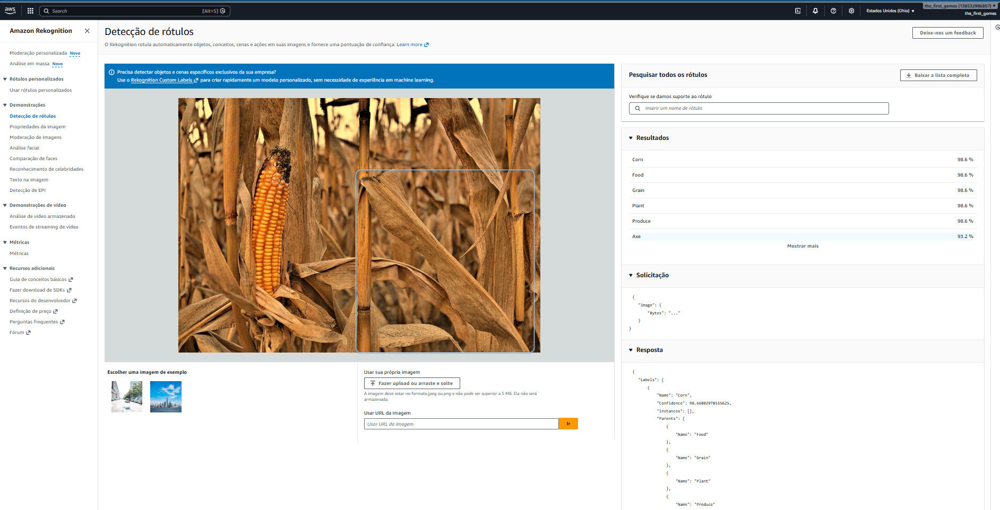
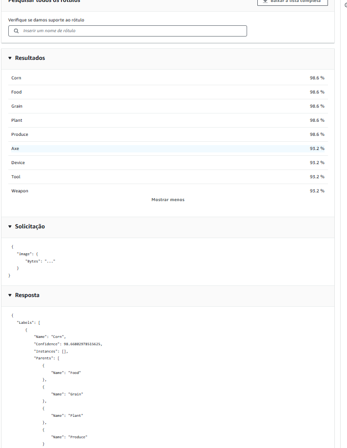
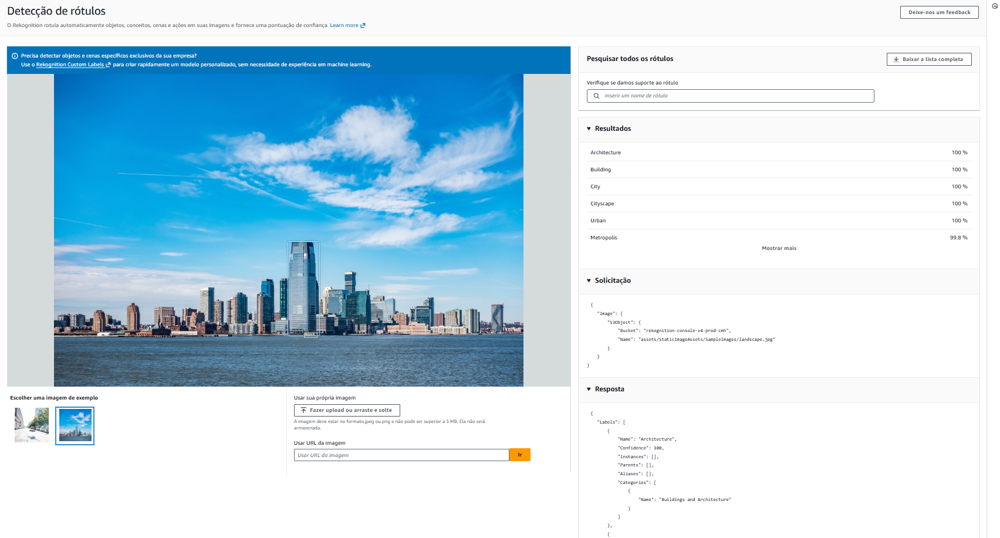
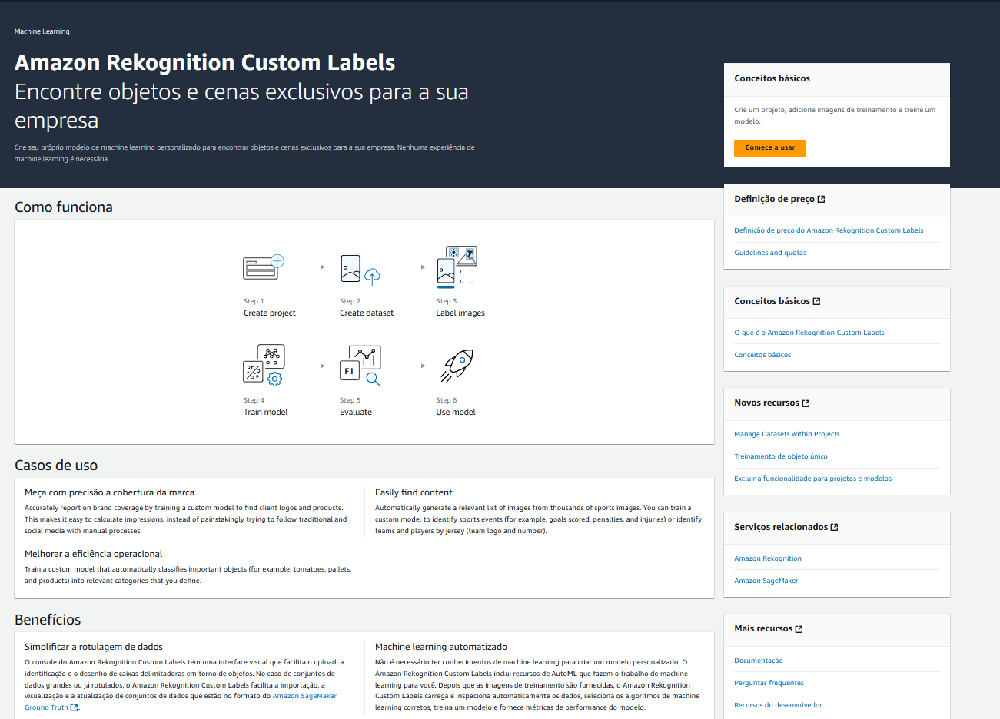

# Ir Além — Opção 1: AWS Rekognition para Monitoramento de Lavoura

### FIAP · Fase 7 · IA Como Fertilizante Digital
**Aluno:** Luan Gonçalves Gomes — RM 566806

---

## Objetivo

Substituir ou complementar a análise OpenCV da Fase 6 com **AWS Rekognition**, serviço de visão computacional da AWS que detecta objetos, cenas e rótulos personalizados em imagens de lavoura sem necessitar de treinamento local.

---

## Arquitetura

```
[Câmera IoT / Upload no Dashboard]
           │
           ▼
[S3 Bucket: farmtech-imagens-lavoura]
           │
           ▼
[AWS Rekognition: DetectLabels / DetectCustomLabels]
           │
           ├─ Label: "Plant Disease" (Confidence > 80%)  ──▶  [SNS Alert]
           ├─ Label: "Healthy Vegetation"                ──▶  [Log OK]
           └─ Label: "Pest" / "Insect" (Confidence > 75%) ──▶  [SNS Alert]
                                                                    │
                                                                    ▼
                                                        [Dashboard Streamlit]
```

---

## Demonstração via Console AWS

### DetectLabels — Resultado em imagem de lavoura

O console do Rekognition permite testar a detecção de rótulos sem nenhuma linha de código. A imagem abaixo mostra o resultado para uma foto de plantação de milho:



Labels detectados com alta confiança (≥ 98.6%): **Corn, Food, Grain, Plant, Produce** — todos relevantes para o contexto agrícola da FarmTech.

### Resposta JSON da API

O painel lateral exibe a solicitação e a resposta completa em JSON, exatamente o formato retornado pela chamada `boto3`:



```json
{
  "Labels": [
    {
      "Name": "Corn",
      "Confidence": 98.668,
      "Instances": [],
      "Parents": [...]
    }
  ]
}
```

### Teste com imagem personalizada

Upload de imagem própria de lavoura e resultado da detecção:



---

## Custom Labels — Modelo Personalizado para FarmTech

Para detecção específica de doenças e pragas que o modelo padrão não cobre, o Rekognition Custom Labels permite treinar um modelo com as próprias imagens da fazenda — sem necessidade de experiência em ML.



### Fluxo de treinamento aplicado à FarmTech

| Step AWS | Aplicação FarmTech |
|---|---|
| **1. Create project** | Criar projeto `farmtech-saude-lavoura` |
| **2. Create dataset** | Upload de fotos de lavoura rotuladas |
| **3. Label images** | Marcar bounding boxes: `saudavel`, `praga`, `doenca_foliar`, `deficiencia_nutricional` |
| **4. Train model** | AWS treina automaticamente (30–90 min) |
| **5. Evaluate** | Verificar precisão por classe (mínimo recomendado: 50 imagens/classe) |
| **6. Use model** | Chamar via `boto3.client('rekognition').detect_custom_labels()` |

> **Custo:** endpoint Custom Labels custa ~$4/hora. Desligue após uso.

---

## Configuração para Uso via boto3

### Pré-requisito — Bucket S3

O Rekognition via boto3 não aceita imagens direto do computador — a imagem precisa estar no S3 primeiro. Na demonstração do console a AWS faz isso internamente. Para uso real via código:

```
AWS Console → S3 → Criar bucket
Nome: farmtech-imagens-lavoura | Região: us-east-2
```

> **Conta pessoal:** o bucket pode ser criado sem configurações extras de política de acesso público — o acesso é feito via credenciais IAM do próprio dono da conta.

### Política IAM necessária

Em conta pessoal com acesso administrativo o Rekognition já funciona sem configuração adicional. Em ambiente corporativo, crie um usuário IAM restrito com apenas as permissões abaixo (princípio do menor privilégio):

```json
{
  "Version": "2012-10-17",
  "Statement": [
    {
      "Effect": "Allow",
      "Action": [
        "rekognition:DetectLabels",
        "rekognition:DetectCustomLabels",
        "s3:PutObject",
        "s3:GetObject"
      ],
      "Resource": "*"
    }
  ]
}
```

### Código de integração com o dashboard FarmTech

```python
import boto3
from pathlib import Path

def analisar_rekognition(caminho_imagem: str, bucket: str = "farmtech-imagens-lavoura",
                          regiao: str = "us-east-2") -> dict:
    """
    Analisa imagem de lavoura com AWS Rekognition DetectLabels.
    Retorna classificação de saúde e ação corretiva.
    """
    s3  = boto3.client("s3", region_name=regiao)
    rek = boto3.client("rekognition", region_name=regiao)

    nome_s3 = f"lavoura/{Path(caminho_imagem).name}"
    s3.upload_file(caminho_imagem, bucket, nome_s3)

    resp = rek.detect_labels(
        Image={"S3Object": {"Bucket": bucket, "Name": nome_s3}},
        MaxLabels=20,
        MinConfidence=60,
    )

    labels = {l["Name"]: l["Confidence"] for l in resp["Labels"]}

    if "Disease" in labels and labels["Disease"] > 75:
        return {"classe": "Doença foliar",
                "confianca": labels["Disease"],
                "acao": "Aplicar fungicida. Retirar folhas afetadas."}

    if any(l in labels for l in ["Pest", "Insect", "Bug"]):
        conf = max(labels.get(l, 0) for l in ["Pest", "Insect", "Bug"])
        return {"classe": "Praga detectada",
                "confianca": conf,
                "acao": "Aplicar defensivo. Isolar talhão afetado."}

    if "Plant" in labels or "Vegetation" in labels:
        return {"classe": "Saudável",
                "confianca": labels.get("Plant", labels.get("Vegetation", 95)),
                "acao": "Nenhuma ação. Monitoramento contínuo."}

    return {"classe": "Inconclusivo",
            "confianca": 0,
            "acao": "Coletar amostra de solo. Verificar manualmente."}
```

---

## Comparação: OpenCV vs. Rekognition

| Critério | OpenCV (Fase 6) | AWS Rekognition |
|----------|----------------|----------------|
| **Custo** | Gratuito | $0,001/imagem (DetectLabels) |
| **Precisão** | Média (análise HSV) | Alta (modelos pré-treinados) |
| **Doenças específicas** | Não detecta | Detecta com Custom Labels |
| **Dependências** | opencv-python local | boto3 + S3 + IAM |
| **Latência** | < 100ms | 200–800ms (rede) |
| **Uso offline** | Sim | Não (requer conexão AWS) |
| **Treinamento customizado** | Requer código | Interface visual + API |

**Recomendação:** OpenCV para alertas rápidos em campo (tempo real via ESP32-CAM); Rekognition para análise periódica de alta precisão e auditoria de lavoura.

---

## Integração com SNS (Alertas Automáticos)

Rekognition + SNS criam um pipeline completo de detecção e notificação aproveitando 100% do código já desenvolvido na Fase 5:

```
Imagem → analisar_rekognition() → classe detectada
    └─▶ verificar_thresholds() [Fase 5]
            └─▶ enviar_alerta_sns() [Fase 5]
                    └─▶ E-mail via AWS SNS → FarmTechAlertas
```

---

## Guia de Prints (salvar em `docs/`)

| Arquivo | Conteúdo |
|---|---|
| `01_detect_labels_resultado.png` | Tela completa DetectLabels com milho + labels + bounding box |
| `02_detect_labels_json.png` | Painel direito com lista de labels e JSON de resposta |
| `03_detect_labels_custom.png` | DetectLabels com imagem própria de lavoura |
| `04_custom_labels_overview.png` | Tela Custom Labels com fluxo de 6 passos |

---

## Referências

- [AWS Rekognition Developer Guide](https://docs.aws.amazon.com/rekognition/latest/dg/what-is.html)
- [boto3 Rekognition API](https://boto3.amazonaws.com/v1/documentation/api/latest/reference/services/rekognition.html)
- [Custom Labels Getting Started](https://docs.aws.amazon.com/rekognition/latest/customlabels-dg/getting-started.html)
