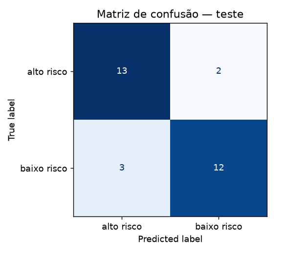

# FIAP - Faculdade de Informática e Administração Paulista

<p align="center">
<a href= "https://www.fiap.com.br/"></a>
</p>

<br>

# CardioIA — Fase 2: Diagnóstico Automatizado (IA no Estetoscópio Digital)

## Nome do grupo
*Cardios da Vida - CardioIA*

## 👨‍🎓 Integrantes:
- <a href="https://www.linkedin.com/in/luan-g-432896b5/">Luan Gonçalves Gomes</a>

## 👩‍🏫 Professores:
### Tutor(a)
- <a href="https://www.linkedin.com/in/sabrina-otoni-22525519b/">Sabrina Otoni</a>

## 🎥 Vídeo de demonstração

**Link (YouTube, não listado):** https://youtu.be/8-ic3pFUlEE

**Repositório público (GitHub):** https://github.com/TheFirstGomes/Estudos/tree/main/FIAP/2Ano/Fase2

## 📜 Descrição

Na Fase 2 do CardioIA construímos um módulo inteligente de apoio à triagem que:

1. **Extrai sintomas** de relatos de pacientes escritos em linguagem natural e **sugere possíveis diagnósticos** a partir de um mapa de conhecimento (sintoma → doença) — abordagem baseada em regras;
2. **Classifica o nível de risco** (*alto risco* / *baixo risco*) de frases de sintomas com **TF-IDF + Machine Learning** — abordagem estatística;
3. **Analisa vieses e distorções** dos dois métodos, em linha com a Governança de Dados iniciada na Fase 1.

> ⚠️ Projeto **educacional**. Os dados são simulados e escritos pelos autores. Nada aqui substitui avaliação médica.

## 📁 Estrutura de pastas

- <b>assets</b>: logo da FIAP e a matriz de confusão gerada pelo notebook.
- <b>data</b>:
  - `frases_sintomas.txt` — Parte 1: 10 relatos de pacientes.
  - `mapa_conhecimento.csv` — Parte 1: mapa de conhecimento *Sintoma 1 | Sintoma 2 | Doença Associada* (64 linhas, 15 doenças).
  - `resultados_diagnostico.csv` — saída do script da Parte 1.
  - `dataset_triagem.csv` — Parte 2: 120 frases rotuladas (`frase,situacao`), 60 alto risco / 60 baixo risco.
- <b>scripts</b>:
  - `extracao_diagnostico.py` — Parte 1: extração de sintomas e sugestão de diagnóstico.
  - `build_notebook.py` — gera o notebook da Parte 2 (opcional, para reprodutibilidade).
- <b>notebooks</b>: `classificador_triagem.ipynb` — Parte 2: TF-IDF, classificação, avaliação e análise de vieses (já executado, com saídas).
- <b>ir-alem-1-portal</b>: Ir Além 1 — portal React + Vite (login simulado, pacientes, agendamentos, dashboard). Ver [README](ir-alem-1-portal/README.md).
- <b>ir-alem-2-ecg-mlp</b>: Ir Além 2 — MLP em Keras para classificar ECG normal × anormal. Ver [README](ir-alem-2-ecg-mlp/README.md).
- <b>README.md</b>: este documento.

## 🔧 Como executar o código

Pré-requisitos: Python 3.10+.

```bash
git clone <url-deste-repositorio>
cd CardioIA-Fase2
# (opcional) python -m venv .venv && .venv\Scriptsctivate   # Windows
pip install -r requirements.txt

# Parte 1 — usa só a biblioteca padrão do Python
python scripts/extracao_diagnostico.py

# Parte 2 — abra o notebook e execute todas as células
jupyter notebook notebooks/classificador_triagem.ipynb
```

---

## Parte 1 — Frases de sintomas + extração de informações

### Relatos (`data/frases_sintomas.txt`)

10 frases com **o que o paciente sente, quando começou e como afeta a rotina**, cobrindo quadros diferentes (dor torácica, cansaço, palpitações, déficit neurológico, pressão alta, falta de ar noturna, pós-voo longo, dor que muda com a posição, desmaio, dor ao esforço). Exemplo:

> *"Sinto cansaço constante há uma semana, mesmo depois de descansar, e meus tornozelos ficam inchados no fim do dia, o que me impede de terminar o trabalho."*

### Mapa de conhecimento (`data/mapa_conhecimento.csv`)

Colunas: `Sintoma 1 | Sintoma 2 | Doença Associada`, em que as duas colunas de sintoma são **expressões equivalentes** (sinônimos) para o mesmo achado. Exemplo:

| Sintoma 1 | Sintoma 2 | Doença Associada |
|---|---|---|
| dor no peito | aperto no tórax | Infarto Agudo do Miocárdio |
| cansaço constante | fadiga | Insuficiência Cardíaca |
| boca torta | rosto caído | Acidente Vascular Cerebral (AVC) |

O mesmo sintoma pode aparecer em várias doenças (ex.: "dor no peito" → Infarto, Angina, Pericardite, Endocardite), como na clínica real.

> **Nota sobre o enunciado:** o exemplo "falta de ar → Angina" foi mantido como *uma* das associações possíveis (a falta de ar acompanha a angina), mas no nosso mapa ela também aponta para Insuficiência Cardíaca e Embolia Pulmonar, que são associações clínicas mais típicas. Por isso o sistema pondera as evidências (abaixo) em vez de aceitar a primeira correspondência.

### Como o script decide (`scripts/extracao_diagnostico.py`)

1. **Normaliza** o texto (minúsculas, sem acentos, sem pontuação).
2. **Procura** cada expressão do mapa como palavra(s) inteira(s) na frase.
3. **Descarta negações** próximas (`sem`, `não`, `nunca`, `nem`) — "sem febre" não ativa "febre".
4. **Pontua** cada doença: cada sintoma encontrado vale `1 / nº de doenças que o compartilham`. Sintomas genéricos ("dor no peito") pesam menos que específicos ("boca torta").
5. Mostra o **ranking das 3 melhores hipóteses** e grava `data/resultados_diagnostico.csv`.

### Resultado nas 10 frases

| # | Hipótese principal | Pontuação | Evidências |
|---|---|---|---|
| 1 | Infarto Agudo do Miocárdio | 1,75 | irradia para o braço esquerdo, dor no peito, suor frio (Angina em 2º: 1,25) |
| 2 | Insuficiência Cardíaca | 2,00 | cansaço constante, tornozelos ficam inchados |
| 3 | Arritmia Cardíaca | 2,00 | coração disparado, palpitações, tonto (Hipotensão Postural em 2º) |
| 4 | AVC | 3,00 | boca torta, fraqueza no lado direito, dificuldade para falar |
| 5 | Hipertensão Arterial | 3,00 | dor de cabeça forte, zumbido no ouvido |
| 6 | Insuficiência Cardíaca | 2,25 | falta de ar ao subir escadas, dormir com dois travesseiros |
| 7 | Embolia Pulmonar | 2,75 | falta de ar de repente, dor ao respirar fundo |
| 8 | Pericardite | 2,75 | piora quando me deito, melhora quando me sento inclinado, febre |
| 9 | Síncope | 1,70 | desmaiei, visão escureceu, tontura |
| 10 | Angina | 2,50 | aperto no tórax, caminho rápido, passa em poucos minutos |

### Limitações da abordagem (honestidade técnica)

- É **correspondência literal de expressões**: "tornozelos *ficam* inchados" só foi reconhecido porque essa variação foi incluída no mapa; "tornozelos *estão* inchados" idem. Sinônimos não cadastrados passam despercebidos.
- A detecção de negação é uma janela de 3 palavras — simples, e sujeita a falhas em frases longas.
- Sinônimos de uma mesma linha às vezes contam duas vezes (ex.: "cansaço" e "cansaço constante" na frase 2).
- As associações sintoma→doença são uma **simplificação didática**, não uma ontologia clínica validada, e as 10 frases e o mapa foram escritos pelo mesmo autor, o que facilita o acerto.

---

## Parte 2 — Classificador de risco (TF-IDF + ML)

### Base (`data/dataset_triagem.csv`)

120 frases (`frase,situacao`), balanceadas: 60 *alto risco* e 60 *baixo risco*. Incluem casos difíceis de propósito: negações ("não sinto dor no peito nem falta de ar" → baixo), sintomas parecidos com gravidades diferentes ("palpitação depois de tomar café" → baixo × "palpitações fortes e sensação de desmaio" → alto) e menções a perfis ("meu pai de 70 anos…", "uma mulher de 55 anos…") distribuídos nas duas classes.

### Método (`notebooks/classificador_triagem.ipynb`)

- **TF-IDF** com unigramas e bigramas, sem acentos (`strip_accents='unicode'`), ajustado só no treino via `Pipeline` (sem vazamento).
- Divisão estratificada 75/25 (90 treino / 30 teste), `random_state=42`.
- Modelos: **Regressão Logística** (escolhida) e **Árvore de Decisão** (comparação).
- Como 30 frases de teste dão uma estimativa ruidosa (cada erro = 3,3 p.p.), também foi feita validação cruzada 5 dobras × 10 repetições.

### Resultados

| Modelo | Acurácia (teste) | Acurácia (validação cruzada) |
|---|---|---|
| **Regressão Logística** | **83,3%** (25/30) | 85,0% ± 6,2 |
| Árvore de Decisão | 70,0% | 76,7% ± 6,9 |

Regressão Logística no teste: precisão/recall de *alto risco* = 0,81 / 0,87; de *baixo risco* = 0,86 / 0,80.



### Padrões e distorções observados

- **Falso negativo mais grave:** "perdi os sentidos por alguns segundos enquanto caminhava" (desmaio com outras palavras) foi classificado como baixo risco. Outro: convulsão com perda de movimento do braço. Em triagem, esse é o erro perigoso.
- **Atalhos lexicais:** entre os termos que mais indicam alto risco aparecem palavras vazias como "no" e "com"; em baixo risco, "leve", "depois de" e "sem". O modelo aprendeu parte do *estilo* das frases da base, não só a gravidade clínica.
- **Negação não é entendida:** "não tenho dor no peito nem falta de ar" recebe P(alto risco) = 0,63, quase igual à frase sem negação (0,74).
- **Vocabulário novo:** "estou muito mal e quero ir ao hospital" → baixo risco (P = 0,42); queixas graves em linguagem coloquial tendem a ser subestimadas.
- **Perfil do paciente:** com a mesma queixa, o risco oscila até 0,15 só trocando o perfil ("meu pai", "minha mãe" e "uma criança" recebem mais risco que "homem/mulher de N anos"). Entre homem e mulher da mesma idade a diferença foi de apenas 0,02–0,03, mas o efeito vem do acaso de quais perfis aparecem na base pequena — um sinal de que o modelo usa termos demográficos que não deveria.
- **Limiar de decisão:** baixar o limiar de 0,5 para 0,4 zerou os falsos negativos no teste, ao custo de subir os falsos positivos de 3 para 7 (acurácia 76,7%). É uma decisão de política clínica, não técnica.

### Quão confiável é este resultado?

Com treino e teste vindos da mesma base pequena, escrita pelo mesmo autor, a acurácia é **otimista** e o desvio de ±6 p.p. da validação cruzada mostra que a diferença entre os dois modelos é real, mas o valor absoluto é incerto. Não há evidência aqui de desempenho em relatos reais.

---

## ⚠️ Governança de Dados e Vieses

- **Origem dos dados:** todas as frases e rótulos são simulados e foram escritos pelos autores — nenhum dado real de paciente foi usado (sem risco de LGPD nesta fase).
- **Viés de rotulagem:** a classificação alto/baixo risco não foi validada por profissional de saúde.
- **Viés de representação:** pouca variação de linguagem (regionalismos, escolaridade, idosos, crianças) e poucas menções a perfis; mulheres e outros grupos têm apresentações atípicas de infarto que o modelo não conhece (ver Fase 1).
- **Avaliação por subgrupo:** feita apenas por sondagem com frases-teste (seção 6.3 do notebook), não por amostras reais estratificadas.
- **Uso responsável:** qualquer sistema real exigiria dados anonimizados, rótulos clínicos, auditoria por subgrupos e um profissional humano na decisão final.

## 🗃 Histórico de lançamentos

* 0.1.0 - Fase 2: extração de sintomas, mapa de conhecimento e classificador TF-IDF.

## 📋 Licença

<p xmlns:cc="http://creativecommons.org/ns#" xmlns:dct="http://purl.org/dc/terms/"><a property="dct:title" rel="cc:attributionURL" href="https://github.com/agodoi/template">MODELO GIT FIAP</a> por <a rel="cc:attributionURL dct:creator" property="cc:attributionName" href="https://fiap.com.br">Fiap</a> está licenciado sobre <a href="http://creativecommons.org/licenses/by/4.0/?ref=chooser-v1" target="_blank" rel="license noopener noreferrer" style="display:inline-block;">Attribution 4.0 International</a>.</p>
