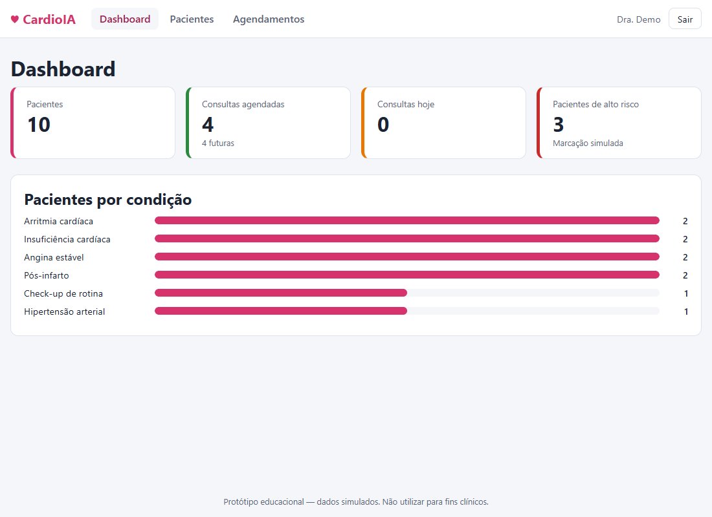
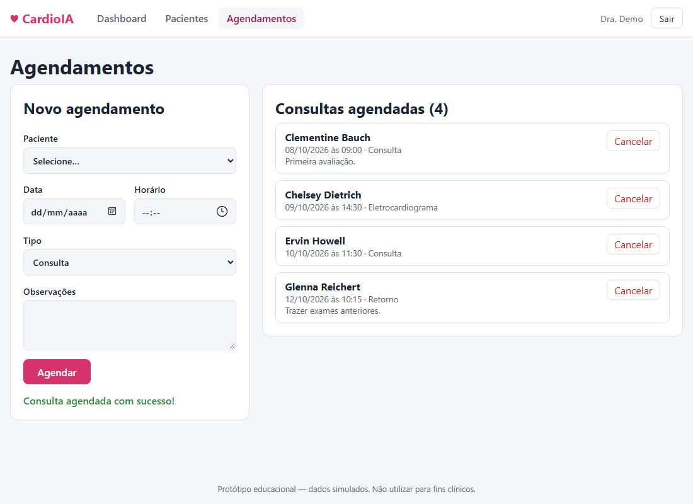
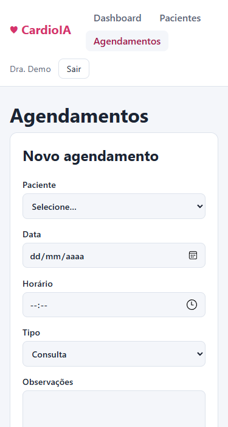

# CardioIA Portal — Ir Além 1: interface do CardioIA

Portal responsivo em **React + Vite** que simula a rotina de um centro de diagnóstico em cardiologia: login, lista de pacientes, agendamento de consultas e um dashboard com métricas. Não há back-end: todos os dados são simulados.

> ⚠️ Protótipo **educacional**. A autenticação é falsa e não oferece segurança real; não use para dados clínicos.

## 👨‍🎓 Integrantes

| Nome completo | RM |
|---|---|
| Luan Gonçalves Gomes | _PREENCHER_RM_ |

Grupo: *Cardios da Vida - CardioIA* · Tutora: Sabrina Otoni

## 🎥 Vídeo de demonstração

**Link (YouTube, não listado):** _COLE_AQUI_O_LINK_DO_VIDEO_

## 🔧 Instalação e execução

Pré-requisitos: Node.js 20+ e npm.

```bash
git clone <url-do-repositorio-CardioIA-Fase2>
cd CardioIA-Fase2/ir-alem-1-portal
npm install
npm run dev        # http://localhost:5173
```

Outros comandos: `npm run build` (build de produção em `dist/`), `npm run preview`, `npm run lint`.

**Login de demonstração:** `demo@cardioia.com` / `cardioia123`

## ✅ Requisitos atendidos

| Requisito | Onde está |
|---|---|
| Autenticação simulada via Context API (JWT fake no `localStorage`) | [`contexts/AuthContext.jsx`](src/contexts/AuthContext.jsx), [`services/authService.js`](src/services/authService.js) |
| Listagem de pacientes com API fake (JSONPlaceholder, com fallback em JSON local) | [`services/patientService.js`](src/services/patientService.js), [`pages/Patients.jsx`](src/pages/Patients.jsx) |
| Formulário de agendamento com `useState` e `useReducer` | [`components/AppointmentForm.jsx`](src/components/AppointmentForm.jsx) |
| Dashboard com contagem de pacientes e consultas | [`pages/Dashboard.jsx`](src/pages/Dashboard.jsx) |
| Proteção de rotas com AuthContext | [`components/ProtectedRoute.jsx`](src/components/ProtectedRoute.jsx) |
| Estilização com CSS Modules, responsiva | arquivos `*.module.css` |

## 📁 Estrutura

```
src/
├── contexts/     AuthContext, PatientsContext, AppointmentsContext (Context API + useReducer)
├── components/   Layout, ProtectedRoute, StatCard, AppointmentForm, AppointmentList
├── services/     authService, patientService, appointmentService
├── pages/        Login, Dashboard, Patients, Appointments, NotFound
└── data/         patients.json (fallback offline)
```

## 🧠 Decisões de projeto

- **Hooks:** `useState` (campos de login, erros e mensagens de interface), `useReducer` (campos do formulário de agendamento e a lista de consultas), `useEffect` (busca de pacientes com `AbortController`, persistência das consultas e logout automático na expiração do token), `useContext` (via hooks `useAuth`, `usePatients`, `useAppointments`), `useMemo` (listas derivadas).
- **Rotas protegidas:** `ProtectedRoute` redireciona para `/login` sem sessão válida e só monta os providers de dados depois do login — nenhum dado é buscado ou exibido antes. Após o login volta à rota que o usuário tentou abrir.
- **JWT fake:** `header.payload.assinatura-falsa` (Base64URL), com campo `exp` de 30 min. Ao carregar, o token é decodificado e **descartado se estiver expirado**.
- **API pública com fallback:** se o JSONPlaceholder estiver offline, o portal usa `src/data/patients.json`, e a tela de pacientes informa a fonte em uso.
- **Dados clínicos simulados:** a API só traz dados cadastrais; idade, condição e "alto risco" são derivados do `id` de forma determinística, apenas para demonstração.
- **Persistência:** consultas ficam no `localStorage` (começam com 3 exemplos). Não há sincronização entre navegadores.

## 🧪 Verificação realizada

Teste ponta a ponta automatizado (Playwright com Edge) cobrindo: redirecionamento sem login, erro de login inválido, login válido com retorno à rota de origem, JWT no `localStorage`, 10 pacientes listados, busca, validação do formulário, criação de agendamento (3 → 4), dashboard atualizado (10 pacientes / 4 consultas), persistência da sessão após recarregar, ausência de rolagem horizontal em 375 px, logout e rejeição de token expirado — sem erros no console. O script não está incluído neste repositório.

## 🖼️ Telas

| Dashboard | Agendamentos | Mobile |
|---|---|---|
|  |  |  |

## ⚠️ Limitações

- Segurança: o JWT é gerado no cliente, a senha de demonstração está no código-fonte e qualquer pessoa pode forjar um token. Serve só para simular o fluxo de interface.
- Sem testes automatizados no repositório; `npm run lint` mostra 3 avisos de *fast refresh* (arquivos de contexto exportam provider e hook juntos), sem erros.
- Sem integração com o módulo de IA das Fases 1 e 2.
