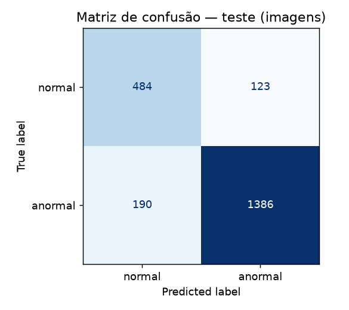
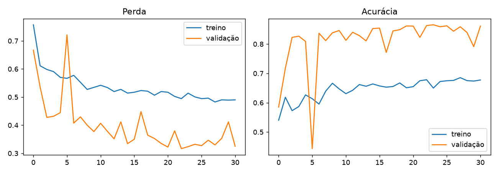

# FIAP - Faculdade de Informática e Administração Paulista

<p align="center">
<a href= "https://www.fiap.com.br/"></a>
</p>

<br>

# CardioIA — Ir Além 2: Diagnóstico visual de ECG com rede neural (MLP)

## Nome do grupo
*Cardios da Vida - CardioIA*

## 👨‍🎓 Integrantes:
- <a href="https://www.linkedin.com/in/luan-g-432896b5/">Luan Gonçalves Gomes</a>

## 👩‍🏫 Professores:
### Tutor(a)
- <a href="https://www.linkedin.com/in/sabrina-otoni-22525519b/">Sabrina Otoni</a>

## 🎥 Vídeo de demonstração

**Link (YouTube, não listado):** [Youtube](https://youtu.be/8-ic3pFUlEE)

## 📜 Descrição

Um MLP (Perceptron Multicamadas) em **Keras** que classifica batimentos de ECG como **normal** ou **anormal**, usando o subconjunto **PTB Diagnostic ECG** do dataset [Heartbeat (Kaggle)](https://www.kaggle.com/datasets/shayanfazeli/heartbeat).

- **Dados:** 14.552 batimentos (4.046 normais, 10.506 anormais), 187 amostras por batimento, valores já normalizados em [0, 1].
- **Pré-processamento de imagem:** o dataset recomendado entrega o ECG como *sinal numérico*, não como arquivo de imagem. Para atender ao enunciado, cada batimento é **renderizado como imagem 64×64 em tons de cinza** (reamostragem do eixo X + quantização do eixo Y + *flatten* para 4.096 entradas). Exemplos em [`images/`](images/).
- **Modelo principal:** MLP `4096 → Dense(256) → Dropout → Dense(64) → Dropout → Dense(1, sigmoid)`, Adam, pesos de classe, *early stopping*.
- **Comparação:** o mesmo tipo de MLP treinado direto no sinal 1D (187 entradas).

> ⚠️ Projeto **educacional**; não é um dispositivo médico.

## 📁 Estrutura de pastas

- <b>notebooks/ecg_mlp.ipynb</b>: notebook comentado e já executado (com saídas e gráficos).
- <b>images/</b>: 10 exemplos de batimentos convertidos em imagem (5 normais, 5 anormais).
- <b>assets/</b>: logo, curvas de treino e matriz de confusão.
- <b>data/</b>: coloque aqui `ptbdb_normal.csv` e `ptbdb_abnormal.csv` (não versionados por tamanho, ~68 MB).
- <b>build_notebook.py</b>: gera o notebook (reprodutibilidade).
- <b>requirements.txt</b>: dependências.

## 🔧 Como executar

1. Baixe o dataset em https://www.kaggle.com/datasets/shayanfazeli/heartbeat e copie **`ptbdb_normal.csv`** e **`ptbdb_abnormal.csv`** para `data/`.
2. Instale as dependências (venv opcional):
   ```bash
   # python -m venv .venv && .venv\Scripts\activate   (Windows)
   pip install -r requirements.txt
   ```
3. A partir de `CardioIA-Fase2/ir-alem-2-ecg-mlp`, abra e execute `notebooks/ecg_mlp.ipynb` (`jupyter notebook`).

> Os testes deste repositório foram executados com TensorFlow 2.22.0rc0 / Keras 3.16 (dev) em Python 3.14. Em outras versões do Python/TensorFlow, os números podem variar ligeiramente.

## 📊 Resultados (conjunto de teste: 2.183 batimentos, divisão 70/15/15, `seed=42`)

| Modelo | Acurácia | AUC-ROC | Recall "anormal" | Recall "normal" |
|---|---|---|---|---|
| Linha de base (sempre "anormal") | 72,2% | — | 100% | 0% |
| **MLP em imagens 64×64** (principal) | **86,2%** | 0,925 | 91,6% | 72,2% |
| MLP no sinal 1D (comparação) | 94,8% | 0,988 | 94,5% | 95,4% |




O MLP em imagens supera a linha de base em ~14 pontos percentuais, mas **perde** para o MLP no sinal bruto: converter o sinal em uma imagem 64×64 descarta informação, e o MLP trata os 4.096 pixels como entradas independentes. No teste de imagens houve 132 falsos negativos (anormal → normal) em 1.576 anormais — o erro mais perigoso em triagem.

## ⚠️ Limitações e governança

- **Provável vazamento por paciente (acurácia inflada):** o PTB-DB tem vários batimentos por paciente e o CSV não informa o paciente. A divisão aleatória por batimento põe batimentos do mesmo paciente em treino e teste. Os valores acima **não** representam desempenho em pacientes novos; uma avaliação válida exigiria divisão por paciente.
- **"Anormal" é um rótulo amplo** (majoritariamente infarto do miocárdio); o modelo não identifica a doença.
- **Proveniência dos dados:** para este desenvolvimento, os CSVs foram obtidos de um espelho público no Hugging Face (`Zermatzor/heartbeat_data`) por não haver credencial do Kaggle disponível; dimensões (4.046 + 10.506 × 188) e rótulos coincidem com o dataset oficial, mas **recomendamos baixar do Kaggle** para garantir a origem.
- **Dados clínicos:** vêm do PhysioNet/PTB (dados anonimizados e públicos); qualquer uso real exigiria validação clínica, diversidade de populações e supervisão médica.

## 🗃 Histórico de lançamentos

* 0.1.0 - MLP de ECG (imagens 64×64 e sinal 1D) em Keras.

## 📋 Licença

<p xmlns:cc="http://creativecommons.org/ns#" xmlns:dct="http://purl.org/dc/terms/"><a property="dct:title" rel="cc:attributionURL" href="https://github.com/agodoi/template">MODELO GIT FIAP</a> por <a rel="cc:attributionURL dct:creator" property="cc:attributionName" href="https://fiap.com.br">Fiap</a> está licenciado sobre <a href="http://creativecommons.org/licenses/by/4.0/?ref=chooser-v1" target="_blank" rel="license noopener noreferrer" style="display:inline-block;">Attribution 4.0 International</a>.</p>
