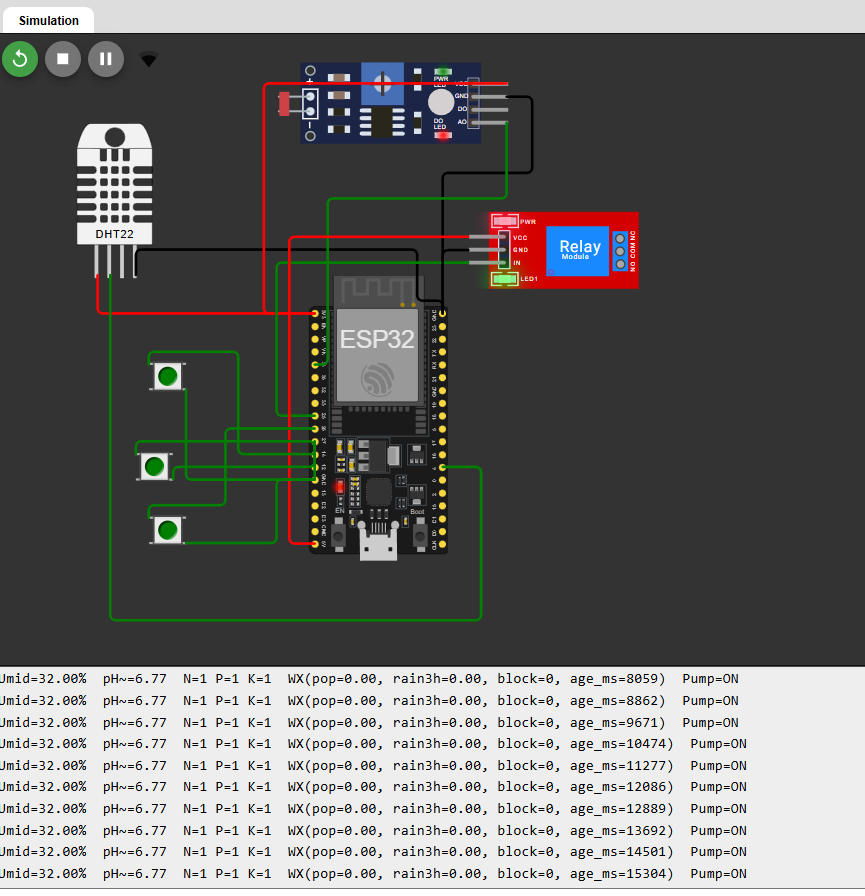
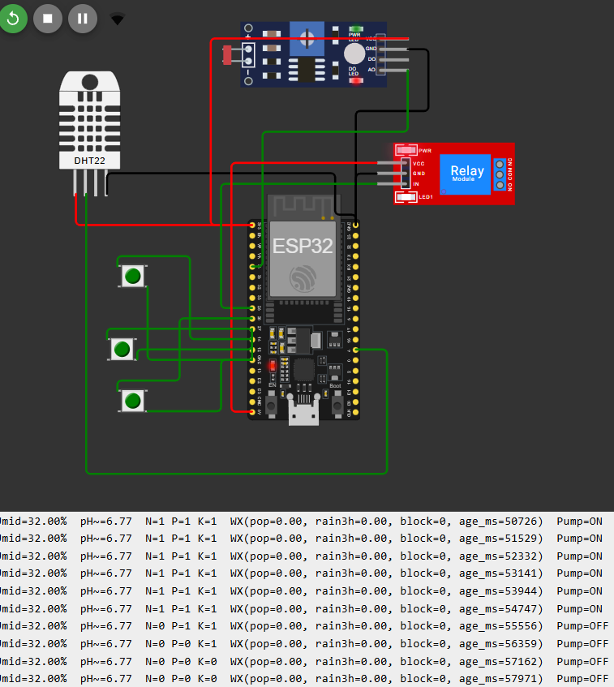

# FIAP - Faculdade de Informática e Administração Paulista

 

# Nome do projeto
Sistema de irrigação e seus opcionais (nota-se o opcional 1 está integrado ao código C++ com a conexão wi-fi sendo bloqueado se o limite ultrapassar 2mm de chuva nas próximas 3h)

## Nome do grupo

## 👨‍🎓 Integrantes: 
- <a href="https://www.linkedin.com/in/luan-g-432896b5/">Luan Gonçalves Gomes 1</a>

## 👩‍🏫 Professores:
### Tutor(a) 
- <a href="https://www.linkedin.com/company/inova-fusca">Nome do Tutor</a>
### Coordenador(a)
- <a href="https://www.linkedin.com/company/inova-fusca">Nome do Coordenador</a>

## 📜 Descrição

Problema: automatizar a irrigação considerando umidade, pH e NPK, evitando desperdício quando houver chuva prevista.

Simulações (Wokwi):

DHT22 → “umidade do solo” (na prática mede ar; uso didático).

LDR (ADC34) → “pH do solo” (mapeamento 0–14).

3 botões (N, P, K) → presença/ausência (press = 1).

Relé (GPIO25) → bomba d’água.

Lógica base (determinística):

Liga se: umidade < 35% E pH ∈ [6.0, 6.8] E N∧P∧K E sem bloqueio meteorológico.

Desliga se: umidade > 45% OU pH fora da faixa OU algum N/P/K = 0 OU bloqueio meteorológico.

Bloqueio meteorológico: com dados válidos (≤3h), se POP ≥ 0,60 OU chuva(3h) ≥ 2,0 mm (OpenWeather /forecast).

Opcionais implementados:

Integração OpenWeather (previsão 3h) no ESP32.

Análise em R  para gerar decisão data-driven e exportar coeficientes/regras para o firmware.

Metáfora rápida: só “abre o semáforo” (liga bomba) quando tudo está verde: umidade baixa, pH adequado, NPK OK e sem chuva chegando.

🔌 Mapeamento de Hardware (ESP32)
Componente	Função	Pino
DHT22	Umidade (didático)	GPIO 4
LDR + resistor	pH simulado (ADC)	GPIO 34
Botão N	Nitrogênio	GPIO 14
Botão P	Fósforo	GPIO 27
Botão K	Potássio	GPIO 26
Relé	Bomba de irrigação	GPIO 25 (ativo ALTO)
🧠 Regras & Decisão (versões)

Determinística (produção mínima):

if (!wx_block && hum < 35 && pH in [6.0, 6.8] && N && P && K) liga();
if ( wx_block || hum > 45 || pH fora || !N || !P || !K) desliga();

Modelo em R (opcional):

Regressão Logística → prob = σ(B0 + B_h*hum + B_pH*ph + B_N*N + B_P*P + B_K*K + B_pop*pop + B_rain*rain3h)

Liga se prob ≥ τ (histerese opcional).

## 📁 Estrutura de pastas

.
├─ README.md                      # este arquivo
├─ assets/                        # imagens do relatório/apresentação
│  └─ logo-fiap.png
├─ wokwi/                         # projeto Wokwi (ZIP)
│  ├─ sketch.ino                  # código final ESP32
│  ├─ diagram.json                # diagrama de conexão
│  └─ libraries.txt               # dependências (se usar)
└─ r_analise/                     # opcional 2 (R)
   ├─ analise_farmtech.R          # script completo e organizado
   ├─ dados.csv                   # dataset (Serial real ou sintético)

## 🔧 Como executar o código

a.Acesse wokwi.com → New Project → ESP32.

b. Substitua o diagram.json pelo arquivo em wokwi/diagram.json.

c. Cole o wokwi/sketch.ino (código completo, já com OpenWeather e logs).

d. Clique Start.

e. Simule: ajuste umidade (DHT), mova luz do LDR (pH), aperte botões N/P/K.

f. Veja o Serial Monitor:

g. leituras (Umid, pH, NPK),

h. previsão (pop, rain3h, block, age_ms),

i. estado da bomba (Pump=ON/OFF).

f. Testes rápidos (opcionais):

g. Override via Serial: digite WX 0.9 3 (força pop=0.9, rain3h=3) → block=1.

h. Ajuste temporário de thresholds (WX_POP_BLOCK, WX_RAIN_BLOCK) no código.

## 🗃 Histórico de lançamentos

* 0.1.0 - 15/10/2025
    *

## 📋 Licença

<a property="dct:title" rel="cc:attributionURL" href="https://github.com/agodoi/template">MODELO GIT FIAP</a> por <a rel="cc:attributionURL dct:creator" property="cc:attributionName" href="https://fiap.com.br">Fiap</a> está licenciado sobre <a href="http://creativecommons.org/licenses/by/4.0/?ref=chooser-v1" target="_blank" rel="license noopener noreferrer" style="display:inline-block;">Attribution 4.0 International</a>.

